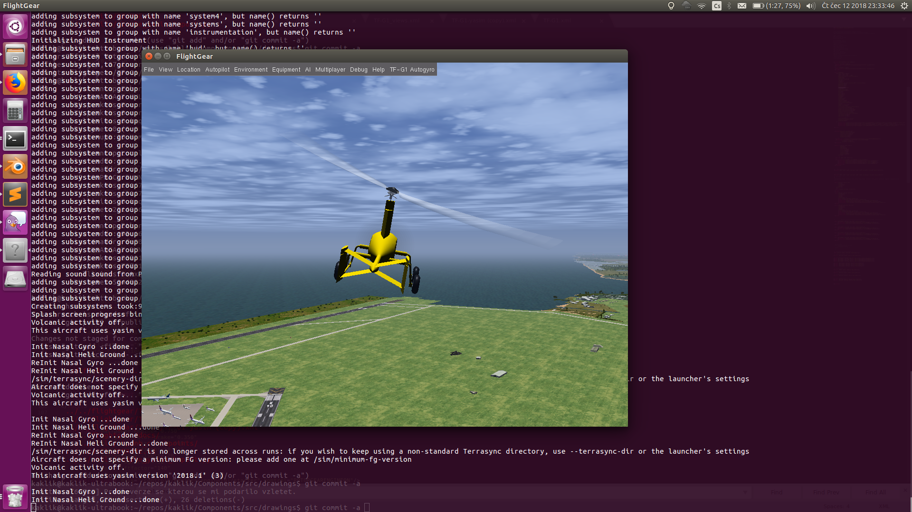

# TF-G1 UAV electric autogyro flightgear simulator model

Model vírníku TF-G1 pro simulátor [Flightgear](https://home.flightgear.org/).  Je určen k neletovému testování letových konfigurací, misí a změn. 

## Instalace a spuštění

### Linux
Složka TF-G1 obsahuje komletní model. Instalace do simulátoru se provede zkopírováním složky mezi ostatní modely Flightgearu. V OS Linux je tato složka umístěna na adrese: /usr/share/games/flightgear/Aircraft/

K instalaci modelu lze použít i simlink do naklonovaného repozitáře.  Flightgear ale v základním nastavení neprochází simlinky, proto je to potřeba povolit parametrem ''--allow-nasal-read'', podle následujícího příkladu.

    fgfs --aircraft=TF-G1 --disable-terrasync --disable-random-objects --disable-real-weather-fetch --allow-nasal-read=/usr/share/games/flightgear/Aircraft/TF-G1/Models/Liveries --timeofday=noon

### Windows

Ve Windows je model potřeba zkopírovat do odpovídající složky mezi modely letadel. 

## Ovládání

Základní návod k ovládání lze otevřít přímo v okně simulátoru volbou Help z nabídky.  Samotné ovládání bez joysticku, nebo jiného pákového ovladače je velmi těžké. Kromě několika funkcí ovládaných klávesami: 

  * klávesa "v" přepíná různé pohledy
  * klávesa "s" roztáčí rotor
  * klávesa "B" Velké B (se shiftem), ovládá parkovací brzdy
  * Page-Up a Page-Down ovládají přípust motoru
  * Tabulátor přepíná režim myši
  * Ctrl+w 	Place winch in front of aircraft, hook in and start winch launch
  * W   Increase winch speed
  * w 	Decrease winch speed
  * Ctrl+o 	Find aircraft for aerotow and hook in
  * o Open both hooks (pulls the yellow lever) 

Všechny ostatní vstupy je potřeba ovládat proporcionálně, je možné omezeně použít myš.  A nebo [RC ovladač v režimu joysticku](https://opentx.gitbooks.io/manual-for-opentx-2-2/radio_joystick.html).

## Vlastnosti modelu

Model zatím zanedbává několik poměrně zásadních vlastností. 

  * Reálný rotor má asi 1/3 hmotnosti uloženou v závaží, které je ve 3/4 délky listu. Model ale předpokládá rovnoměrné rozložení hmotnosti po délce listu. V důsledku toho je v simulátoru energie rotoru nižší, než skutečná.
  * Model využívá na místo elektromotoru spalovací motor, který nemá tak vysokou dynamiku jako elektrický.
  * Tah vrtule je zatím přesně v ose motoru. Reálný kus má vrtuli skloněnou asi 10stupňů dolů
  * Ocas je podepřen uprostřed jedním virtuálním podvozkovým kolečkem pro usnadnění startu a přistání.  Vhodnější by zřejmě bylo model upravit pro dvě kolečka pod každou polovinou ocasní plochy. 

## TODO

  * Publikovat model v [seznamu modelů](http://wiki.flightgear.org/Table_of_models)
  * Doplnit reálné textury

